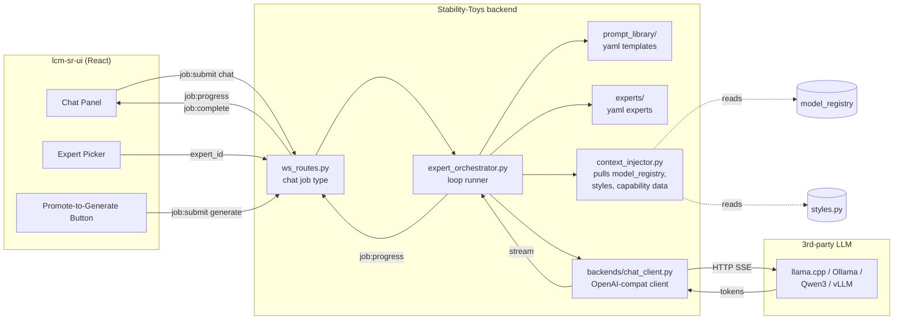
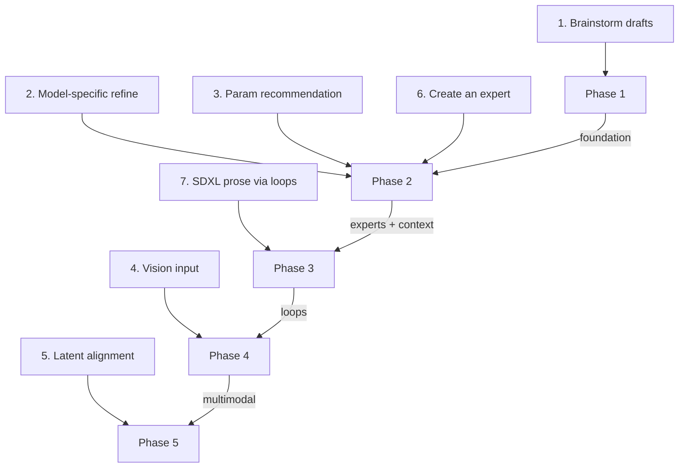
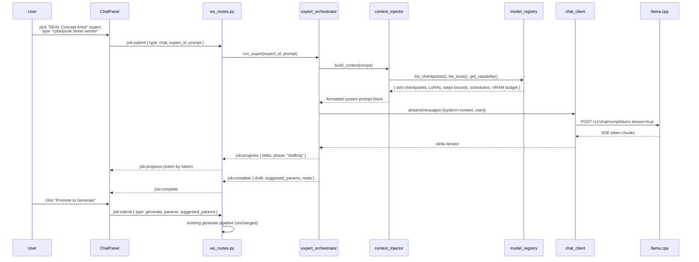

# LLM Expert Integration Proposal

> **Status:** Proposal (pre-spec). Builds on `docs/superpowers/specs/2026-04-07-chat-completions-backend-design.md`, which covers the transport layer (WebSocket `chat` job type + OpenAI-compatible client).

**Goal:** Turn the in-progress chat completions backend into a creative assistant that helps users brainstorm, refine, parameterize, and critique image generations — with LLM orchestration living server-side and only the chat surface living client-side.

**Architecture:** Thin LLM proxy already planned in the chat-completions spec is extended with a prompt template library, an "expert" abstraction (persisted prompt + context recipe), and a loop orchestrator that can inject live capability data (model registry, LoRA list, scheduler options) into LLM calls. Frontend gets a chat panel, expert picker, and a "promote to generation" action that hands an LLM-produced draft directly to the existing `generate` job type.

**Tech Stack:** Python backend (existing FastAPI + WebSocket hub), `httpx`, YAML for expert definitions, existing React/JSX frontend under `lcm-sr-ui/src/`, OpenAI-compatible LLM endpoint (llama.cpp, Ollama, vLLM, Qwen3, etc.).

---

## 1. Context And Motivation

The immediate user request was "I want to talk with LLMs." The natural temptation is to do it entirely in the browser — llama.cpp speaks HTTP, the frontend can fetch it directly, and no backend work is needed.

That works for pure chat. It stops working the moment any of the following become features:

- draft refinement that knows what **this user's installed SDXL/PONY checkpoint** actually supports
- parameter recommendations that reflect the **live model registry** (steps, schedulers, VRAM budget, LoRA stack)
- multi-step agent loops (draft → critique → refine → param-pick)
- reusable "experts" (persisted prompt + tool recipe) shared across sessions
- vision model input feeding into a draft (file handling, GPU co-location)
- latent-space alignment between LLM-proposed concepts and the diffusion pipeline

Every one of those requires server-side state, server-side capability data, or server-side orchestration. A browser-only implementation means reimplementing half the model registry in JavaScript and scattering prompt templates across the frontend.

The existing chat-completions spec already commits to a thin async client (`backends/chat_client.py`) and a `chat` WebSocket job type. This proposal extends that foundation with the orchestration layer needed for the seven features in the brief.

---

## 2. Frontend-Only Versus Backend-Orchestrated: Decision Matrix

| Feature | Description | Needs backend? | Why |
|---|---|---|---|
| 1 | Brainstorm drafts for image generation | No (mostly) | Pure prompt + chat. Frontend-only would work if it stopped here. |
| 2 | Refine & model-specific-ize (PONY vs SDXL vs Zbrush) | **Yes** | LLM must see the live model registry, LoRA list, and style metadata from `backends/model_registry.py` and `backends/styles.py`. |
| 3 | Recommend exact generation parameters | **Yes** | Needs live capability data (steps bounds, schedulers, VRAM, fp8 policy). Ties into the SDXL fp8 capability loader already in flight. |
| 4 | Vision model input (image → draft) | **Yes** | Large multimodal models, file uploads, GPU co-location with diffusion worker. |
| 5 | Latent-space alignment draft ↔ diffusion | **Yes** | Must run alongside the diffusion pipeline to share latent representations. |
| 6 | "Create an expert" | **Yes** | Persistence, versioning, and sharing across sessions. |
| 7 | SDXL-specific prose via loops | **Yes** | Multi-step orchestration with retries and context injection. |

**Score:** 6 of 7 features require backend. Verdict: **backend-orchestrated, thin frontend chat surface.**

---

## 3. Target Architecture



**Key property:** the browser only ever talks to the Stability-Toys WebSocket hub. The LLM endpoint URL, API key, and model name never leak to the client. The same browser session can `promote` a finished chat draft into a `generate` job without round-tripping a new WebSocket connection.

---

## 4. Component Responsibilities

### Server-side (new or extended)

| Component | Path | Responsibility |
|---|---|---|
| Chat client | `backends/chat_client.py` | **Exists in chat-completions spec.** Thin async OpenAI-compat client. Streams tokens. |
| Prompt library | `prompts/` (new dir of YAML files) | Versioned, git-tracked prompt templates with jinja-style variable slots. One file per template. |
| Expert definitions | `experts/` (new dir of YAML files) | A named bundle of `{ system_prompt, default_model, default_params, context_recipe, post_processors }`. Users can add their own. |
| Context injector | `server/context_injector.py` (new) | Given a `context_recipe`, gathers live data (available checkpoints, LoRAs, scheduler list, VRAM, current mode) and formats it into a system-prompt block. |
| Expert orchestrator | `server/expert_orchestrator.py` (new) | Runs single-shot or multi-step loops. Drives `ChatCompletionsClient`. Emits structured progress events. Uses the context injector before each call. |
| WebSocket dispatcher | `server/ws_routes.py` | **Extended from chat spec.** Accepts `jobType: "chat"` with optional `expert_id` and `recipe` in params. Routes to orchestrator instead of calling the client directly. |
| Modes API | `server/model_routes.py` | **Extended.** Exposes expert list (`/api/experts`) for the frontend picker. Does not leak LLM endpoint details. |

### Client-side (new)

| Component | Path | Responsibility |
|---|---|---|
| Chat panel | `lcm-sr-ui/src/components/chat/ChatPanel.jsx` | Message list, token streaming, submit box. |
| Expert picker | `lcm-sr-ui/src/components/chat/ExpertPicker.jsx` | Dropdown of experts from `/api/experts`. Stores current selection in local state. |
| Promote to generate | `lcm-sr-ui/src/components/chat/PromoteToGenerate.jsx` | Parses the last LLM draft into `{ prompt, negative_prompt, params }` and submits a `generate` job via the existing hook. |
| Chat hook | `lcm-sr-ui/src/hooks/useChatJob.js` | WebSocket chat job lifecycle, mirrors `useGenerateJob` pattern. |

---

## 5. Feature Coverage Map

Where each of the seven user-requested features lands:



---

## 6. End-To-End Workflow: Draft → Generate

How a single user interaction flows through the system once Phase 2 is in place:



**Note the critical handoff:** the orchestrator returns a structured `suggested_params` object alongside the free-text draft. The frontend does not have to parse English — it receives a JSON object shaped like the generate job payload and can submit it directly.

---

## 7. Phases

Each phase produces working software that can be merged and used independently. No phase depends on future-phase files.

### Phase 0 — Prerequisite (already in progress)

**Out of scope for this proposal.** Covered by `2026-04-07-chat-completions-backend-design.md`.

Ships: `chat` WebSocket job type, `backends/chat_client.py`, `chat` block in mode config, `/api/modes` reports `chat_enabled`.

Blocking-on: none for this proposal. Phase 1 should begin only after Phase 0 lands.

### Phase 1 — Plain Chat Surface

**Objective:** Give the user a working chat box wired to the existing backend chat job.

**Ships:**
- `lcm-sr-ui/src/components/chat/ChatPanel.jsx` — message list + input + streaming render
- `lcm-sr-ui/src/hooks/useChatJob.js` — WebSocket lifecycle hook modeled on existing `useGenerateJob` pattern
- Minimal integration point in `lcm-sr-ui/src/App.jsx` — a toggle or side-panel route
- No backend changes beyond what Phase 0 already delivered

**Feature coverage:** #1 (brainstorm drafts).

**Success criteria:**
- User can type a prompt and receive a streamed response from the configured llama.cpp/Ollama endpoint
- Tokens arrive incrementally in the panel
- Errors from the backend appear inline
- Image generation continues to work unaffected

**Why it's independently shippable:** No new backend code. No dependency on experts, orchestrator, or context injector. If we stopped here, the user already has "talk with LLMs."

---

### Phase 2 — Experts And Context Injection

**Objective:** Make the LLM aware of what this specific Stability-Toys instance can actually generate. Introduce the expert abstraction.

**Ships:**
- `experts/` directory with YAML definitions (seed set: `sdxl-concept-artist.yaml`, `prompt-refiner.yaml`, `param-advisor.yaml`)
- `server/context_injector.py` — pulls live data from `backends/model_registry.py`, `backends/styles.py`, and mode config, returns a formatted context block
- `server/expert_orchestrator.py` — resolves an `expert_id` to a definition, calls the context injector, builds the messages array, delegates to `chat_client`
- `server/ws_routes.py` — extended chat handler now accepts `expert_id` in params and routes to the orchestrator
- `server/model_routes.py` — new `/api/experts` endpoint returning `[{ id, name, description, default_mode_family }]`
- `lcm-sr-ui/src/components/chat/ExpertPicker.jsx` — dropdown populated from `/api/experts`
- `lcm-sr-ui/src/components/chat/PromoteToGenerate.jsx` — takes the last assistant message's structured `suggested_params` and submits a generate job
- Structured output contract: experts return a JSON object appended after their free-text reply (e.g. fenced `params` block the orchestrator parses)

**Feature coverage:** #2 (model-specific refine), #3 (parameter recommendation), #6 (create an expert).

**Success criteria:**
- User can pick an expert from a dropdown and ask it to refine a draft
- LLM replies reference actual checkpoint names, LoRAs, and scheduler options from the live registry — not generic SDXL knowledge
- LLM replies include a structured `params` block that `PromoteToGenerate` can parse and hand to the generate job
- Adding a new expert is a file-level change (drop a YAML in `experts/`, restart, it appears in the picker)

**Why it's independently shippable:** No multi-step loops, no vision, no latents. Single LLM call per user message. The orchestrator is a straight function, not a loop runner. All seven user features except brainstorm still either work or are clearly scoped to later phases.

**Critical design decision in this phase:** the expert definition schema. Get the YAML shape right here because later phases build on it. Proposed minimum:

```yaml
# experts/sdxl-concept-artist.yaml
id: sdxl-concept-artist
name: SDXL Concept Artist
description: Brainstorms concepts and refines them into SDXL-ready prompts
default_mode_family: sdxl
context_recipe:
  include:
    - checkpoints
    - loras
    - styles
    - scheduler_options
    - steps_bounds
    - vram_budget
system_prompt_template: |
  You are an SDXL concept artist embedded in Stability-Toys.
  Available checkpoints: {{ checkpoints }}
  Available LoRAs: {{ loras }}
  ...
output_contract:
  format: markdown_with_fenced_json
  fenced_block_name: params
  schema:
    prompt: string
    negative_prompt: string
    steps: int
    guidance: number
    sampler: string
```

---

### Phase 3 — Loop Orchestrator

**Objective:** Let an expert run multi-step loops (draft → critique → refine) instead of a single call.

**Ships:**
- `server/expert_orchestrator.py` — extended with `run_loop(expert_id, prompt, max_iterations)`
- Loop contract in expert YAML: `loop.phases` list defining `draft`, `critique`, `refine` stages with per-phase system prompts
- `job:progress` events now include `phase` field so the frontend can show which step is running
- `lcm-sr-ui/src/components/chat/ChatPanel.jsx` — renders phase indicators during a looped call
- New seed expert `experts/sdxl-loop-refiner.yaml` that replaces the need for the specialized SDXL prose model the user already has

**Feature coverage:** #7 (SDXL prose via loops, targeted replacement for the specialized model).

**Success criteria:**
- A loop-enabled expert runs N iterations, each iteration's output feeds the next iteration's context
- The frontend shows "drafting", "critiquing", "refining" phase labels as they happen
- Final output is compared side-by-side against the specialized SDXL prose model on a held-out set of visual descriptions; loop output is subjectively equal or better
- Loops respect a hard iteration cap and surface a clear error if they exceed it

**Why it's independently shippable:** Single-shot experts from Phase 2 still work. Loops are opt-in per expert definition. If loops prove bad, disable them and fall back to Phase 2 single-shot.

**Risk to call out in the spec:** loops multiply latency and token cost. The phase contract must include an "early exit" mechanism (a phase can signal "good enough, stop").

---

### Phase 4 — Vision Input

**Objective:** Allow an expert to accept an image as input alongside text, using a vision-capable LLM endpoint.

**Ships:**
- `backends/chat_client.py` — extended to support the OpenAI chat-completions `image_url` content part (most modern endpoints, including llama.cpp with LLaVA-family models, accept this format)
- Expert YAML gains `accepts_vision: true` flag
- `server/ws_routes.py` — chat job params accept an `image_ref` pointing to an already-uploaded file in the existing gallery/upload pipeline
- `lcm-sr-ui/src/components/chat/ChatPanel.jsx` — drag-and-drop or picker for attaching a gallery image to the next chat message
- Seed expert `experts/vision-critic.yaml` — takes an image and a goal, describes what to change

**Feature coverage:** #4 (vision input).

**Success criteria:**
- User drags a generated image into the chat panel, types "make this more dramatic"
- Vision-capable LLM receives the image and returns a refined prompt draft
- The refined draft can still be promoted to a new generate job (closing the evolution loop)
- Non-vision experts are unaffected (`accepts_vision: false` is default)

**Why it's independently shippable:** Only experts with `accepts_vision: true` require a vision-capable endpoint. All other experts keep working against text-only endpoints. The file handling reuses the existing gallery upload path, so no new storage code is needed.

---

### Phase 5 — Latent Alignment (Exploratory)

**Objective:** Let the LLM layer and the diffusion layer share latent-space awareness so drafts and generations stay closer in concept space.

**Status:** Exploratory. This phase is less certain than the previous four and should be re-scoped into its own spec before implementation begins.

**Possible scope:**
- Expose diffusion-side conditioning embeddings (e.g. CLIP text encoder output) to the orchestrator as an opt-in context feature
- Let an expert inspect the CLIP embedding of its own proposed prompt and iterate until the embedding lands near a target region
- Requires orchestrator to call into a diffusion worker for embedding computation (not for full generation)

**Feature coverage:** #5 (latent alignment).

**Deferred decisions:**
- Which embeddings to expose (text encoder only? full conditioning tensor? textual-inversion concept vectors?)
- Whether this is an orchestrator feature or a new job type
- Performance budget — embedding calls are cheap compared to generation but not free

**Do not begin until:** Phases 1–4 have landed and real usage has produced concrete pain around "LLM draft drifts from generated image."

---

## 8. Cross-Phase Contracts To Lock Early

These are things the spec that follows this proposal MUST nail down before Phase 1 code is written, because changing them later is expensive:

1. **Expert YAML schema.** Lock the minimum viable fields in Phase 2. Reserve namespace for Phase 3 (`loop`) and Phase 4 (`accepts_vision`) so early experts stay forward-compatible.
2. **Structured output contract.** How does an expert return machine-readable params alongside free text? Proposed: fenced JSON block with a declared name. Alternative: tool-use API if the endpoint supports it. Pick one.
3. **`job:progress` shape.** Phase 1 only needs `delta`. Phase 3 adds `phase`. Phase 4 may add `attachments`. Define the envelope once so the frontend's `useChatJob` hook does not need to change per phase.
4. **`/api/experts` response shape.** Keep it minimal and additive: `{ id, name, description, default_mode_family, accepts_vision? }`.
5. **Where experts and prompts live.** Proposed: `experts/` and `prompts/` at repo root, sibling to `backends/` and `server/`. They are data, not code, and should be user-editable without a Python import.

---

## 9. Library Choices

Python ecosystem only. The orchestrator is ~200 LOC of glue code wrapped around a small set of focused libraries. Framework-scale dependencies (LangChain, Spring AI, DSPy) are explicitly rejected — see Appendix A for the full reasoning.

### Primary Stack

| Library | Purpose | Introduced In | Why This One |
| --- | --- | --- | --- |
| `pydantic-ai` | Typed LLM agents: structured outputs, retries, streaming, optional tool calling | Phase 2 | From the pydantic team. Small dep tree. Native async. Works against any OpenAI-compatible endpoint (llama.cpp, Ollama, vLLM, Qwen3, OpenAI). Designed as a lightweight alternative to LangChain. |
| `pydantic` | Expert output schemas, config validation | Phase 2 | Already present in project. Pairs directly with `pydantic-ai`. |
| `jinja2` | Prompt template rendering with variable slots | Phase 2 | Tiny. Standard tool for templated text. Expert YAML embeds Jinja expressions for context injection. |
| `httpx` | HTTP transport for the thin `ChatCompletionsClient` (Phase 0) | Phase 0 (already in chat-completions spec) | Async. Streaming. No OpenAI SDK coupling. |
| `PyYAML` | Loading expert and prompt YAML files | Phase 2 | Already present in project for mode config. |

### Situational Additions

| Library | Adopt When | Purpose |
| --- | --- | --- |
| `tenacity` | First time we need exponential backoff on transient HTTP failures (429, 5xx) | Retry decorators for HTTP calls. Tiny and focused. |
| `instructor` | If `pydantic-ai` ever feels too opinionated for a specific expert | Narrower tool for structured outputs + retry. Can coexist with `pydantic-ai`. |
| `outlines` | If llama.cpp consistently produces malformed JSON that retries cannot fix | Grammar-constrained generation forces valid JSON at decode time. Specialist tool. |
| `burr` | Only if Phase 3 loop design grows beyond ~4 phases with branching transitions | Explicit state machines for LLM loops. Defer until a plain `while` loop is clearly insufficient. |

### Loop Control Stays Hand-Rolled

`pydantic-ai` handles per-call concerns (typing, validation, retry, streaming). The phase sequence itself — draft → critique → refine → early-exit — stays as a plain async function in `server/expert_orchestrator.py`. No framework tells us how to loop. This keeps control flow readable and debuggable, and avoids coupling the orchestrator's shape to a library's abstraction.

Reference shape for Phase 3:

```python
async def run_expert_loop(expert, user_prompt, max_phases=4):
    draft = await expert.draft_agent.run(user_prompt)
    for _ in range(max_phases - 1):
        critique = await expert.critic_agent.run(draft.data)
        if critique.data.is_good_enough:
            break
        draft = await expert.refiner_agent.run(
            user_prompt,
            message_history=[draft, critique],
        )
    return draft.data
```

### Typed Expert Example

A Phase 2 expert wired up with `pydantic-ai`:

```python
from pydantic import BaseModel
from pydantic_ai import Agent
from pydantic_ai.models.openai import OpenAIModel

class GenerateParams(BaseModel):
    prompt: str
    negative_prompt: str
    steps: int
    guidance: float
    sampler: str

model = OpenAIModel(
    model_name="llama3.2",
    base_url="http://localhost:11434/v1",
)

concept_artist = Agent(
    model,
    result_type=GenerateParams,
    system_prompt=rendered_system_prompt,  # from jinja2 + context_injector
)

result = await concept_artist.run(user_prompt)
# result.data is a typed GenerateParams — no fenced-JSON parsing, no regex
```

The structured output contract mentioned in Section 8 is satisfied natively by `pydantic-ai`'s `result_type` — the library handles the round-trip of "ask the LLM to emit JSON matching this schema, validate it, retry on failure."

---

## 10. Risks And Tradeoffs

| Risk | Mitigation |
|---|---|
| Backend becomes a catch-all for LLM logic | Keep the chat client thin. Only context injection and loop orchestration live server-side. Prompt text lives in YAML, not Python. |
| Expert schema churns across phases | Lock Phase 2 schema as the frozen baseline. Later phases add optional fields only. Document which fields each phase introduces. |
| Loops explode in latency and token cost | Hard iteration cap per expert. Early-exit signal. Log per-phase token usage. |
| Vision support requires a different endpoint than text chat | Expert YAML points to a named endpoint profile, not a global one. Mode config already supports multiple modes — reuse that mechanism. |
| Structured output parsing is fragile | Prefer tool-use/function-calling where the endpoint supports it. Fall back to fenced JSON with strict schema validation and a retry-on-parse-failure loop. |
| Latent alignment is speculative | Phase 5 is deferred and requires its own spec. Do not commit to it from earlier phases. |
| Users expect their existing specialized SDXL prose model to keep working | Phase 3 replaces it with a loop-based approach but does not delete the old path. Keep the specialized model available as a named expert until loop quality is proven. |

---

## 11. Open Questions For The Spec

Each of these should be answered in the spec that follows this proposal, before coding begins:

1. Is the expert definition format YAML or TOML? (Proposal assumes YAML for parity with `conf/modes.yaml`.)
2. Do experts support per-expert endpoint overrides, or do they inherit from mode config? (Recommended: inherit; override only if proven necessary.)
3. How are user-authored experts persisted across container restarts? (Bind-mount `experts/` into the container, or a dedicated volume?)
4. Should `/api/experts` be gated by mode, so only experts compatible with the current mode family appear in the picker?
5. Does the chat panel live as a side panel, a modal, or a dedicated route in `lcm-sr-ui`?
6. How do we handle the first-run case when no experts are installed? (Ship a seed set in-repo.)

---

## 12. Success Criteria For The Whole Initiative

This initiative is successful when a user can:

1. Open Stability-Toys, click a chat panel, pick "SDXL Concept Artist"
2. Say "I want a painterly cyberpunk street vendor scene"
3. Receive a refined prompt that references LoRAs actually installed on this machine
4. Click "Promote to Generate" and see the image appear in the existing gallery
5. Drag the generated image back into the chat, pick "Vision Critic", ask "make the lighting more cinematic"
6. Receive a revised prompt and parameters, promote it again, and converge on a final image within 3–4 round trips

And we want all of that without the browser ever knowing the LLM endpoint URL, without hardcoding prompt text in JavaScript, and without reimplementing the model registry on the client.

---

## 13. Next Step

The next step after this proposal is approved is a dedicated **spec** (not a plan) that nails down the Phase 2 expert schema, the structured output contract, and the `/api/experts` response shape. Phase 1 can begin in parallel with spec work because it only touches frontend code against an existing backend surface.

Suggested spec filename: `docs/superpowers/specs/2026-04-XX-llm-expert-orchestration-design.md`.

---

## Appendix A — Rejected Alternatives

This appendix exists so contributors do not re-litigate the framework question every six months. Each rejected option is recorded with what it offered, why it was rejected for **this** project, and the conditions under which it would be worth revisiting.

### A.1 LangChain / LangChain-Community

**What it offers:** Chains, agents, memory modules, output parsers, prompt templates, wide LLM provider coverage, LangSmith observability.

**Why rejected:**

- Heavy dependency tree, split across `langchain-core`, `langchain-community`, `langchain-openai`, `langchain-text-splitters`, etc. Upgrading one package regularly breaks the others.
- Frequent breaking API changes. Tutorials go stale within months.
- Abstraction tax: debugging your own code requires reading LangChain internals. Docs lag behind source.
- Your transport need is trivial (OpenAI-compatible HTTP). `backends/chat_client.py` is ~100 LOC. LangChain wraps the same call in three layers of classes.
- You only target OpenAI-compatible endpoints (llama.cpp, Ollama, vLLM, Qwen3, OpenAI). Multi-provider abstraction has zero value here.
- LangChain's agent and memory models are more opinionated than your expert design. YAML-driven phase loops beat `AgentExecutor`.
- Observability couples to LangSmith. You prefer stdout logs + existing WebSocket progress envelope.

**Revisit if:** The project ever needs to integrate with 10+ heterogeneous LLM providers with wildly different APIs, or takes on complex RAG with vector stores and rerankers, or hires a team where "LangChain experience" is a filter.

---

### A.2 Spring Boot + Spring AI (separate JVM service)

**What it offers:** Mature JVM framework, `ChatClient`, `Advisor` pattern for multi-step chains, `StructuredOutputConverter`, `PromptTemplate`, Micrometer observability, enterprise ecosystem.

**Why rejected:**

- Stability-Toys is a single-process Python application. Adding a JVM service means a second language, second runtime, second deployment target.
- Cold start + memory footprint of a Spring Boot process is 200–500MB minimum before doing any work.
- **State-locality problem is the killer.** The LLM orchestrator must see live SDXL state: `backends/model_registry.py`, `backends/scheduler_registry.py`, `server/mode_config.py`, `backends/styles.py`, the SDXL fp8 capability loader, and the worker pool. All of that is mutable Python state in the running Stability-Toys process. A JVM orchestrator would need one of:
  - Pull HTTP endpoint on the Python side (latency + schema drift per request)
  - Pub/sub bus (NATS / Redis / Kafka — new failure mode)
  - Shared database (ephemeral state written to disk)
  - Poll + cache (stale state windows during mode switches)
  All four options cost more than keeping the orchestrator in-process with the state it needs.
- The "promote to generate" action becomes cross-process IPC: JVM sends a request back to Python to start a generate job. More wire format, more failure paths.
- No team justification for adding JVM skills to a Python-only project.

**Revisit if:** Stability-Toys expands into a multi-service platform where LLM orchestration is shared across unrelated products; or a JVM service is already running in the stack for other reasons; or enterprise audit/observability stacks become a hard requirement.

---

### A.3 DSPy

**What it offers:** Programmatic prompt optimization via compiled pipelines. Research-grade approach to prompt engineering.

**Why rejected:**

- Research-heavy mental model dominates the design. Every expert becomes a `Signature` and `Module`, which is more ceremony than the use case needs.
- Optimizer pipelines assume you have training data and a metric. Your experts are hand-crafted creative tools, not optimization targets.
- Adds a framework's worldview to a problem that does not benefit from it.

**Revisit if:** The project moves into systematic prompt optimization with labeled datasets and metrics (e.g. measuring which prompt variants produce higher-quality SDXL images on a held-out benchmark).

---

### A.4 LiteLLM

**What it offers:** Unified client for many LLM providers with a built-in router.

**Why rejected:**

- Every target endpoint already speaks the OpenAI chat completions contract. Multi-provider abstraction adds a layer for no benefit.
- The router is useful for load-balancing or fallback across providers — not a current need.

**Revisit if:** You ever need to route between, say, a local llama.cpp for cheap calls and a hosted Claude/GPT for high-quality calls, with automatic fallback.

---

### A.5 LlamaIndex / Haystack

**What it offers:** RAG pipelines, document ingestion, vector stores, retrievers, query engines.

**Why rejected:**

- This initiative is about creative orchestration, not retrieval. No document corpus. No vector store. No retrieval step.

**Revisit if:** The project grows a knowledge base (e.g. a library of past successful prompts, reference images with embeddings) that experts should retrieve from at inference time.

---

### A.6 Burr (deferred, not rejected)

**What it offers:** Explicit state machines for LLM applications. DAG-style state transitions.

**Status:** Held in reserve for Phase 3. Not chosen now because Phase 3's phase loop is expected to be a plain async `while` with an enum. If the loop graph grows beyond ~4 phases with branching transitions, Burr becomes worth reconsidering.

**Revisit if:** Loop control flow becomes too complex to hold in a single function.

---

### A.7 Magentic, Marvin, Guidance (noted but not chosen)

**What they offer:**

- `magentic` — decorator-based `@prompt` that turns Python functions into LLM calls with typed outputs
- `marvin` — structured outputs + simple task primitives
- `guidance` — constrained generation + templating

**Why not chosen:**

- `magentic` and `marvin` overlap with `pydantic-ai` but have smaller communities and less recent activity.
- `guidance` is a specialist tool for constrained grammar generation. `outlines` is preferred for that specific job if the need arises (see Section 9).

**Revisit if:** `pydantic-ai` stalls as a project, or a specific feature in one of these libraries becomes compelling.

---

### Summary Matrix

| Option | Verdict | Primary Reason |
| --- | --- | --- |
| `pydantic-ai` | **Chosen** | Typed outputs, retries, streaming, OpenAI-compat, small dep tree |
| LangChain | Rejected | Framework tax, dep hell, abstraction overhead, no multi-provider need |
| Spring AI + JVM | Rejected | State-locality breaks across process boundary; language split |
| DSPy | Rejected | Optimizer worldview mismatches creative use case |
| LiteLLM | Rejected | Multi-provider routing not needed |
| LlamaIndex / Haystack | Rejected | RAG-focused, no corpus involved |
| Burr | Deferred | Phase 3 loops likely simple enough for plain `while` |
| Magentic / Marvin / Guidance | Noted | Overlap with `pydantic-ai`, smaller communities |
