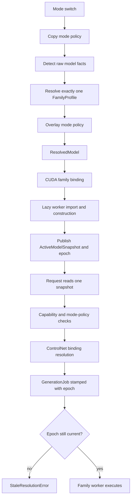

# HunyuanDiT Family-Profile Architecture Design

**Issue:** `STABL-ichgkgno`

**Brainstorm:** `ewgzdmdnfumoczdfyergbyghcwsggdij` v7

**Status:** Approved for implementation planning at `f22e336` (2026-07-17)

**Runtime proof:** merged spike PR #16

## Purpose

Generalize Stability Toys' model-family architecture so SD1.5/SD2.x, SDXL, and
HunyuanDiT use one explicit family contract without turning the CUDA worker into
a multi-family god object. Refactor SD and SDXL onto the contract without
observable behavior change, then add HunyuanDiT as detector facts, neutral
registry data, a CUDA family binding, and a thin denoiser worker.

This design replaces scattered family strings and repeated detection with one
resolved value that remains coherent from model load through request execution.
It also prevents platform-wide capability flags from admitting operations that
the active family cannot execute.

## Proven Runtime Baseline

The spike is a GO, not an implementation substitute. On the NVIDIA host it
proved:

| Gate | Result |
| --- | --- |
| Dependency imports | `diffusers=0.39.0`, `transformers=4.57.6`, `sentencepiece=0.2.2` |
| Base load | `HunyuanDiTPipeline` loaded all seven components in fp16 |
| ControlNet load | `HunyuanDiT2DControlNetModel` loaded the Tencent Canny checkpoint |
| Composition | `HunyuanDiTControlNetPipeline.from_pipe(base, controlnet=...)` succeeded |
| Generation | accepted 1024x1024 Canny-conditioned output, 30 steps in 1:43 |
| Resource observation | 21.37 GiB peak allocated VRAM |
| Test path | rendered `test-cuda` Compose service with an actual NVIDIA device request |

The production dependency floor becomes `diffusers>=0.39.0`, retains
`transformers>=4.30.0,<5.0`, and retains `sentencepiece>=0.2.0`. The CUDA
acceptance image must exercise the tested 4.57.6/0.2.2 Transformer tokenizer
stack even when dependency ranges permit later compatible releases.

## Scope

This delivery includes:

- corrective detector facts for UNet versus transformer architectures
- a platform-neutral `FamilyProfile` registry and exact-one resolver
- an explicit `ResolvedModel` emitted before mode overlays can influence family
- a wire-safe, data-only `ResolvedModel` trace contract: frozen
  `ModelInfoSnapshot` codec, `schema_version`, canonical `resolution_id`, and
  the `ModelArtifactRef`/`LocalModelBinding` split
- family-by-platform worker and execution-capability bindings
- one coherent active-model snapshot and stale-resolution rejection
- profile-driven conditioning and ControlNet family validation
- behavior-preserving SD1.5/SD2.x and SDXL migration
- a native-conditioning HunyuanDiT CUDA worker
- one Canny-first HunyuanDiT mode and ControlNet registry entry
- dependency, warning, CPU-contract, and live-CUDA acceptance coverage

## Non-Goals

- Materialized BERT+mT5 conditioning is deferred. HunyuanDiT delegates prompt
  encoding to Diffusers through native conditioning.
- HunyuanDiT img2img and combined img2img+ControlNet are not supported.
- Depth and Pose model enablement are deferred until each checkpoint and its
  preprocessing path receives live acceptance. This delivery proves Canny.
- Scheduler fallback cleanup, `/models/status` family exposure, the live
  `utils/detect_model_type.py` CLI migration, style/LoRA compatibility changes,
  dead detector cleanup, and unused VRAM-estimator cleanup remain follow-ups.
- There is no cross-family latent routing and no unified denoiser pipeline.
- The measured VRAM value does not become a `FamilyProfile` field.
- Remote processors are not implemented. This delivery ships the wire contract,
  codec, and consumption rules only; no node ever receives a traced
  `ResolvedModel` over a network in this delivery.
- Full content addressing is deferred: local `ModelArtifactRef.digest`
  (sha256 of content) stays unpopulated until a remote processor exists. Hub
  refs carry `repo@revision`; local refs carry the location-stable structural
  name/size manifest fingerprint defined in §3 (no mtime, no path).

## Current Failure Model

The current load and request paths have five correctness problems:

1. `worker_factory.py` dispatches from `cross_attention_dim` and defaults every
   non-SDXL match to the SD worker.
2. A Hunyuan Diffusers directory has `transformer/`, no `unet/`, and two text
   encoders. The detector therefore has no UNet CAD and silently classifies the
   directory as SDXL at 0.6 confidence.
3. `WorkerPool` detects then overlays mode policy, while the factory retains a
   second detection fallback and request admission detects the model again.
4. WebSocket admission reads mode and provider-wide capability values
   separately. A queued mode switch can make those reads disagree with the
   worker that eventually executes the job.
5. CUDA base behavior assumes `pipe.unet`, SDXL ownership of
   `text_encoder_2`, and Diffusers `ControlNetModel`, none of which is valid for
   HunyuanDiT.

## Architecture

### 1. Detector Facts

`utils.model_detector.ModelInfo` gains detector-owned architecture facts:

```python
@dataclass
class ModelInfo:
    # Existing fields remain.
    base_arch: str = "unknown"           # "unet" | "transformer" | "unknown"
    transformer_kind: str | None = None  # "hunyuandit" for this delivery
```

These are facts, not dispatch decisions. `DiffusersDetector` reads
`model_index.json` first:

- a declared `unet` component sets `base_arch="unet"`
- a declared `transformer` component sets `base_arch="transformer"`
- `transformer/config.json` with `_class_name="HunyuanDiT2DModel"` sets
  `transformer_kind="hunyuandit"`
- absent or ambiguous components leave the fact unknown and must not guess

Phase 0 starts by committing a minimal metadata fixture derived from
`Tencent-Hunyuan/HunyuanDiT-v1.1-Diffusers`. It contains only:

```filetree
tests/fixtures/models/hunyuandit-v1.1-diffusers/
├── model_index.json
├── transformer/
│   └── config.json
├── text_encoder/
│   └── config.json
└── text_encoder_2/
    └── config.json
```

The fixture preserves the architecture-bearing values from the real artifact:
`HunyuanDiTPipeline`, `HunyuanDiT2DModel`, BERT plus T5 encoders, transformer
`cross_attention_dim=1024`, and `cross_attention_dim_t5=2048`. The transformer
CAD must not populate or masquerade as the existing UNet CAD field. Hunyuan's
`pooled_projection_dim=1024` is internal transformer configuration; it does not
mean the pipeline accepts an SDXL-style pooled prompt embedding.

`VariantClassifier` gates its entire variant classification on
`base_arch == "unet"`: a transformer (DiT) or an ambiguous/unknown architecture
is left `variant=UNKNOWN` with no compatible worker, and family resolution owns
it. Gating only the dual-encoder SDXL heuristic is insufficient — an ambiguous
`unet`+`transformer` directory would otherwise reach the cross-attention-dim
branch (`cross_attention_dim == 2048` from the declared UNet config) and become
a dispatchable SDXL. Existing SD fixture outputs remain byte-for-byte equal
except for the additive `base_arch="unet"` field. The first Hunyuan RED test
asserts that the fixture is not SDXL before the Hunyuan classification turns
green.

`SafetensorsDetector` and `CheckpointDetector` also set
`base_arch="unet"` when their existing UNet key/config extraction succeeds.
They do not add a new lineage heuristic. Without this additive fact, current
single-file SD models would stop matching both neutral SD family predicates.

### 2. Neutral Family Contract

Add `backends/family_profiles.py`. It is import-clean: no Torch, Diffusers, CUDA
worker, or server-state imports.

```python
@dataclass(frozen=True)
class FamilyProfile:
    # Pure, comparable, wire-safe data. No callables, ever.
    family_id: str
    encoder_roles: tuple[str, ...]
    pooled_required: bool
    pooled_projection_role: str | None
    control_image_kwarg: str


@dataclass(frozen=True)
class FamilyRegistration:
    # Selection behavior is registry-local and never serialized.
    profile: FamilyProfile
    detect: Callable[[ModelInfo], bool]


FAMILY_REGISTRY: tuple[FamilyRegistration, ...] = (...)


def resolve_family(model_info: ModelInfo) -> FamilyProfile:
    matches = tuple(r for r in FAMILY_REGISTRY if r.detect(model_info))
    if len(matches) != 1:
        raise FamilyResolutionError(model_info.path, matches)
    return matches[0].profile


def validate_family_id(family_id: str) -> str:
    if family_id not in family_ids():
        raise UnknownFamilyError(family_id)
    return family_id
```

`detect` lives only on `FamilyRegistration`; `FamilyProfile` is pure data. This
keeps every downstream carrier of the profile — `ResolvedModel`, request
traces, the §6 constructor defaults — serializable and value-comparable by
construction. Registry self-validation additionally asserts profile purity: no
profile field may hold a callable or other non-JSON-safe value.

Registry rows are:

| Family | Predicate | Encoder roles | Pooled | Projection role | Control kwarg |
| --- | --- | --- | --- | --- | --- |
| `sd15` | UNet and CAD in `{768, 1024}` | `("text_encoder",)` | no | `None` | `image` |
| `sdxl` | UNet and CAD in `{1280, 2048}` | `("text_encoder", "text_encoder_2")` | yes | `text_encoder_2` | `image` |
| `hunyuandit` | transformer kind is HunyuanDiT | `("text_encoder", "text_encoder_2")` | no | `None` | `control_image` |

`sd15` is an execution family and continues to front SD1.5, SD2.0, and SD2.1.
`sdxl` continues to front Base and Refiner. Lineage remains in
`ModelInfo.variant`.

The resolver requires exactly one match. Registry order stabilizes error text
only. Registry self-validation rejects duplicate IDs, empty encoder roles,
pooled projection roles absent from `encoder_roles`, projection roles on
non-pooled profiles, and any known fixture that matches zero or multiple rows.
`checkpoint_variant` is forbidden in predicates because mode policy can overlay
it.

### 3. Resolution Emits a Value

Add `backends/model_resolution.py` and move `merge_mode_capabilities()` out of
`worker_pool.py` into this component.

`ResolvedModel` is immutable, data-only, and wire-safe: it may appear verbatim
in a request trace, and a future remote processor may consume it without
re-detecting or re-resolving family. It therefore carries no callables, no live
`ModelInfo`, and no host-local authority.

```python
@dataclass(frozen=True)
class ModelInfoSnapshot:
    # Frozen, JSON-safe capture of detector output at resolution time.
    # Includes every architecture fact (base_arch, transformer_kind, CAD,
    # encoder hidden sizes, variant by value) plus loader/policy facts.
    # Contains NO host path: `ModelInfo.path` is stripped at freeze time.
    ...


@dataclass(frozen=True)
class ModelArtifactRef:
    # Location-neutral model identity. Never a bare host path, and no field
    # may vary between nodes holding the identical artifact (no mtime).
    kind: str            # "hub" | "local-file" | "local-dir"
    name: str            # hub: repo id; local: basename
    revision: str | None # hub revision when known
    fingerprint: str     # location-stable structural fingerprint (see below)
    digest: str | None   # sha256 when computed; population deferred (see below)


@dataclass(frozen=True)
class LocalModelBinding:
    # Node-local load authority. NEVER serialized into traces.
    model_path: str


@dataclass(frozen=True)
class ResolvedModel:
    schema_version: int
    resolution_id: str        # canonical content hash (see below)
    model_ref: ModelArtifactRef
    raw_info: ModelInfoSnapshot
    profile: FamilyProfile    # pure data per §2
    info: ModelInfoSnapshot


def resolve_model(model_path: str, mode: ModeConfig) -> tuple[ResolvedModel, LocalModelBinding]:
    raw = detect_model(model_path)
    profile = resolve_family(raw)
    enriched = merge_mode_capabilities(raw, mode)
    resolved = ResolvedModel(
        schema_version=RESOLVED_MODEL_SCHEMA_VERSION,
        resolution_id=_content_hash(...),
        model_ref=_artifact_ref(model_path),
        raw_info=freeze_model_info(raw),
        profile=profile,
        info=freeze_model_info(enriched),
    )
    return resolved, LocalModelBinding(model_path=model_path)
```

The ordering is structural: family resolution consumes detector output before
mode overlays. `raw_info` and `info` are distinct frozen captures.
`WorkerPool._load_mode` calls this function once and passes both emitted values
to the platform factory. The final factory signature is:

```python
class WorkerFactory(Protocol):
    def __call__(
        self, worker_id: int, resolved: ResolvedModel, binding: LocalModelBinding
    ) -> PipelineWorker: ...
```

The migration may temporarily accept the old `model_path`/`model_info` factory
shape, but that fallback is deleted in the same delivery. The final path has no
factory `inspect_model()` fallback and no request-time model re-detection.

**Snapshot codec.** The total round-trip guarantee is
`ModelInfoSnapshot ↔ JSON`: every architecture field survives (including
`base_arch` and `transformer_kind`), `ModelVariant` is restored by value, and
non-JSON-safe metadata entries fail at freeze time — at resolution, not later
at trace time. Reconstructing a live `ModelInfo` is a separate, explicitly
partial operation — `thaw_model_info(snapshot, binding: LocalModelBinding)` —
which rehydrates `path` from the node-local binding; there is deliberately no
`snapshot → ModelInfo` inverse without a binding, because the snapshot carries
no path by design.
The existing lossy `ModelInfo.to_dict()` is not the codec and is not extended
into one. The codec **strips `ModelInfo.path`**: a host path is node-local
state, so it may appear nowhere in the wire form — snapshots are hashed, and a
path would make the identical resolution hash differently on different nodes.
The detection path lives only in `LocalModelBinding`, which never serializes.

**Identity, staged.** `resolution_id = sha256(JCS(payload))` where `JCS` is
RFC 8785 JSON Canonicalization and `payload` covers `schema_version`,
`model_ref`, `raw_info`, **the complete embedded `profile` (every field, not
just `family_id` — two resolutions differing only in profile data must never
share an ID)**, and `info`. A committed golden vector (fixed payload → exact
canonical bytes → exact hash) pins the encoding; any codec change that breaks
the vector is a schema change and must bump `schema_version`. `resolution_id`
is portable resolution-descriptor identity — it identifies *the resolution*,
not the artifact bytes, and is never proof of identical weights; the §5
`resolution_epoch` remains the in-process TOCTOU guard, and the two are never
interchangeable.

Artifact identity is two-tier, and the tiers must never be conflated:

- **Weak fingerprint** (`ModelArtifactRef.fingerprint`) — a location-stable
  structural fingerprint: cheap correlation for diagnostics and local cache
  reasoning. Identical artifacts on different nodes produce the identical
  fingerprint (no mtime, no path), but it fingerprints *structure*, not bytes —
  same-sized different weights collide. A weak fingerprint is therefore
  **never** sufficient to identify an executable artifact.
- **Strong identity** — `digest` (full-content sha256) or, for `hub` refs, an
  immutable commit-hash `revision`. A mutable hub tag or branch name is not
  strong identity.

**Cross-node execution requires strong identity.** A consumer may correlate,
log, and diagnose with weak fingerprints, but it must refuse to *execute* a
traced `ResolvedModel` whose `model_ref` carries neither a `digest` nor an
immutable hub revision — that refusal is a `ResolutionCompatibilityError`.
In-process use never crosses this boundary: the local `ActiveModelSnapshot`
already holds its own `LocalModelBinding`.

| kind | fingerprint (weak, correlation only) |
| --- | --- |
| `hub` | `repo@revision` |
| `local-file` | `sha256(JCS([name, byte_size]))` |
| `local-dir` (Diffusers directory) | `sha256(JCS(manifest))` per the manifest rules below |

Manifest rules for `local-dir` (deterministic by construction): walk the
directory recursively; include regular files only; entries are
`[relative_path, byte_size]` with POSIX `/` separators, NFC-normalized,
relative to the model root; sort bytewise by `relative_path`. A symlink
anywhere in the tree fails fingerprinting with an explicit error — model
directories with links have no portable identity.

Node-local freshness heuristics (mtime) belong in `LocalModelBinding` cache
logic if ever needed, never in the ref. `digest` population is deferred until a
remote processor actually exists; until then no cross-node execution is
possible, so the strong-identity requirement is contract text with a test, not
a live gate. The schema is stable either way.

**Consumption rules.** A consumer of a traced `ResolvedModel` (diagnostics
today, a remote processor later) validates `schema_version`, validates
`profile.family_id` against its own registry, and verifies the traced profile
equals its canonical registry row **field-for-field — any difference raises
`ResolutionCompatibilityError`; neither side silently wins.** It resolves
`model_ref` to its own `LocalModelBinding` and selects its own family-platform
binding. It never re-detects, never re-resolves family, and never receives
`detect` or worker references — those are not in the wire format by
construction. Pickle is forbidden for this contract.

### 4. Family by Platform Binding

Platform-wide `BackendCapabilities` retains only platform services:
generation, modes, super-resolution, and model-registry statistics. Move
img2img, ControlNet, and combined execution claims into an import-clean family
binding contract in `backends/platforms/base.py`:

```python
@dataclass(frozen=True)
class ExecutionCapabilities:
    supports_img2img: bool
    supports_controlnet: bool
    supports_img2img_and_controlnet: bool


@dataclass(frozen=True)
class FamilyPlatformBinding:
    worker_ref: str
    execution_capabilities: ExecutionCapabilities
```

`backends/platforms/cuda_bindings.py` owns the single CUDA table:

```python
CUDA_FAMILY_BINDINGS = {
    "sd15": FamilyPlatformBinding(
        "backends.cuda_worker.DiffusersCudaWorker",
        ExecutionCapabilities(True, True, True),
    ),
    "sdxl": FamilyPlatformBinding(
        "backends.cuda_worker.DiffusersSDXLCudaWorker",
        ExecutionCapabilities(True, True, True),
    ),
    "hunyuandit": FamilyPlatformBinding(
        "backends.cuda_worker.DiffusersHunyuanDiTCudaWorker",
        ExecutionCapabilities(False, True, False),
    ),
}
```

The provider exposes read-only binding lookup. Request admission reads only
eager strings and booleans. `create_cuda_worker()` is the sole caller that
resolves `worker_ref` with `importlib`; therefore server boot, non-CUDA hosts,
status reads, and rejected requests never import Torch or Diffusers worker code.
`BackendProvider` names this operation `family_binding(family_id)`. CPU, MLX,
and RKNN providers return no binding for unsupported families and update their
platform-wide capability constructors when the execution fields move out.

Unknown neutral families raise `FamilyResolutionError`. A known family without
a binding on the selected platform raises `UnsupportedFamilyError`. A known
binding that lacks the requested operation fails admission before preprocessing.

Request admission selects among all four combinations explicitly:

| Request | Required cell capability |
| --- | --- |
| txt2img | base generation service only |
| img2img | `supports_img2img` |
| ControlNet txt2img | `supports_controlnet` |
| img2img + ControlNet | `supports_img2img_and_controlnet` |

The worker also rejects unsupported init-image combinations as defense in depth.

### 5. Active Snapshot and Resolution Epoch

`WorkerPool` owns one immutable authority value:

```python
@dataclass(frozen=True)
class ActiveModelSnapshot:
    mode_name: str
    mode: ModeConfig
    resolved: ResolvedModel
    binding: LocalModelBinding   # node-local; excluded from any trace export
    resolution_epoch: int
```

The mode stored in the snapshot is a deep copy. A frozen wrapper around a shared
mutable `ModeConfig` is insufficient. The pool protects snapshot publication and
reads with its state lock. `resolved` is the portable authority (its
`resolution_id` identifies the resolution across nodes); `binding` and
`resolution_epoch` are node-local lifecycle state and never leave the process.

Load sequence:

1. Resolve from model path and a copied mode.
2. Construct and configure the worker from `ResolvedModel` plus `LocalModelBinding`.
3. Register resource observations.
4. Under the state lock, increment the epoch and atomically publish worker,
   mode name, and `ActiveModelSnapshot`.
5. Start or continue the worker loop.

An explicit mode switch or unload invalidates the old active snapshot before
loading a replacement. Failed loads leave no active snapshot and no worker.
Idle eviction is different: it may release the worker while retaining the same
snapshot and epoch, but demand reload must reconstruct from the retained
`ResolvedModel`. If it re-detects or changes policy, it installs a new snapshot
and epoch.

At request admission, routes call `get_active_model_snapshot()` once. That one
value supplies:

- mode policy and request defaults
- family-platform capability checks
- active family for ControlNet registry compatibility
- the epoch stamped onto `GenerationJob`

This applies to every mode-backed submission surface, specifically
`ws_routes.handle_job_submit()`, `lcm_sr_server.generate()`, and
`lcm_sr_server._run_generate_from_dict()`. Each captures the snapshot before
ControlNet preprocessing. Unsupported family-cell operations therefore fail
before generated artifacts or model loads. Legacy non-mode generation remains
outside this snapshot path.

`CudaGenerationRuntime` forwards `get_active_model_snapshot()` and changes its
mode-backed submission path to accept the already captured snapshot and resolved
ControlNet bindings. It no longer calls `get_current_mode()`,
`get_mode_config()`, or `detect_model()` inside `submit_generate()`. The
WebSocket path may continue to construct `GenerationJob` directly, but it must
stamp the same captured epoch and bindings. HTTP and WebSocket therefore differ
only in transport, not in family authority.

```python
@dataclass
class GenerationJob(Job):
    # Existing fields remain.
    resolution_epoch: int = field(kw_only=True)
```

Immediately before `worker.run_job()`, while executing serially on the worker
queue, the pool compares the job epoch with the current active snapshot. A
mismatch raises `StaleResolutionError` and never invokes the worker. This closes
the sequence in which a request is admitted under family A, queues behind a mode
switch, and executes on family B.

### 6. Conditioning Contract

Change both closed literals to `str`:

- `ModelContextDescriptor.model_family`
- `ConditioningCompatibility.model_family`

Each frozen dataclass validates the value with `validate_family_id()` in
`__post_init__`. Unknown family strings fail at construction; there is no SDXL
fallback.

`CudaWorkerBase` assigns `family_profile` before
`_set_native_conditioning_defaults()`. The factory always supplies the resolved
profile. To preserve existing direct worker construction and unchanged GPU
worker tests, constructor defaults reference the canonical registry objects:
the base/SD worker defaults to `SD15_PROFILE`, the SDXL worker to
`SDXL_PROFILE`, and the Hunyuan worker to `HUNYUANDIT_PROFILE`. These are
references to the registry's objects, not duplicate family declarations. The
conditioning methods derive encoder roles, pooled requirement, and projection
role from that profile.

Artifact validation derives required slots from the same profile. It does not
use `if family == "sdxl" else ...`; unknown families cannot enter because the
contract validates at construction.

HunyuanDiT uses two encoder roles but `pooled_required=False`. Its empty/native
conditioning configuration returns delegated prompts, allowing Diffusers to
perform BERT and mT5 tokenization and embedding. `compel_service.py` remains
unchanged.

### 7. CUDA Worker Delegates

The CUDA base gains narrow behavioral hooks:

```python
def _quantization_targets(self, pipe: Any) -> tuple[Any, ...]: ...
def _controlnet_model_cls(self) -> type[Any]: ...
supports_attention_processor_swap: bool  # class attribute
```

Required behavior:

| Worker | Quantization targets | ControlNet class | Attention processor swap |
| --- | --- | --- | --- |
| SD1.5/SD2.x | `pipe.unet` | `ControlNetModel` | allowed |
| SDXL | `pipe.unet`, `pipe.text_encoder_2` | `ControlNetModel` | allowed |
| HunyuanDiT | `pipe.transformer` only | `HunyuanDiT2DControlNetModel` | forbidden |

The SD rows preserve current fp8 behavior. Hunyuan does not quantize mT5 in the
first delivery because that target was not validated by the spike.

Add `DiffusersHunyuanDiTCudaWorker` with these responsibilities:

- call the base constructor with the Hunyuan profile before conditioning setup
- require a Diffusers-directory base model
- load `HunyuanDiTPipeline.from_pretrained(..., torch_dtype=self.dtype)`
- keep the native DDPMScheduler unless mode policy explicitly selects a tested
  compatible scheduler
- load Hunyuan ControlNet through the family hook and existing cache
- compose `HunyuanDiTControlNetPipeline.from_pipe()`
- use `control_image` through `FamilyProfile.control_image_kwarg`
- omit the SD/SDXL per-step guidance window: `HunyuanDiTControlNetPipeline.__call__`
  accepts `controlnet_conditioning_scale` but has no `control_guidance_start` or
  `control_guidance_end`, so the shared ControlNet kwargs are filtered before the
  call rather than passed through
- keep the family's native attention processors: `_setup_pipe_memory_opts` skips
  both `enable_attention_slicing` and `enable_xformers_memory_efficient_attention`
  when `supports_attention_processor_swap` is false
- pass `use_resolution_binning=True` on pipeline calls
- support txt2img with zero or one ControlNet binding in the first mode
- reject every request with an init image
- preserve existing PNG metadata, cache release, seed, and error cleanup seams

The Hunyuan worker does not inherit from the SDXL worker. Both happen to have two
text encoders, but their denoisers, prompt contracts, pooled behavior, schedulers,
and img2img capabilities differ.

SD1.5 and SDXL pipeline assembly, scheduler fallback, style checks, and run paths
remain behaviorally unchanged. Existing mismatch assertions stay worker-local.

### 8. Dependency and Warning Dispositions

Hunyuan worker construction performs an early family-specific dependency check
before model download:

- `HunyuanDiTPipeline` is importable
- `HunyuanDiTControlNetPipeline` is importable
- `HunyuanDiT2DControlNetModel` is importable
- `T5Tokenizer.from_pretrained` is callable

Failure raises a concise dependency error containing installed Diffusers,
Transformers, and SentencePiece versions. The check remains lazy: selecting an
SD family or booting a non-CUDA provider does not import the Hunyuan stack.

The spike warnings have these production dispositions:

| Warning | Decision |
| --- | --- |
| Safety checker absent | Preserve the repository's existing unfiltered-server posture; do not claim filtered output and do not hide the Diffusers warning. Public exposure policy remains an operator concern outside this family refactor. |
| `learn_sigma` and `norm_type` ignored by the ControlNet class | Allow exactly these two known checkpoint extras for the validated Tencent Canny artifact; keep the warning visible and fail tests if new unexpected config incompatibilities or missing weights appear. |
| `cross_attention_kwargs ['image_rotary_emb'] ... will be ignored` | Treat as a failure, never as noise. `HunyuanDiT2DModel` delivers rotary positional embeddings through `cross_attention_kwargs`, and a substituted processor drops them silently, so the run stays green while output degrades to noise. The worker prevents it by declining processor swaps; the CUDA acceptance additionally fails on any `will be ignored` warning captured from the `diffusers` logger during generation. |
| dtype advisory after `from_pipe`/`.to()` | Load base and ControlNet with `torch_dtype`; place components before composition; do not recast the composed pipeline or call `.to(dtype=...)` after `from_pipe`. Device-only movement remains allowed where required. |

The measured 21.37 GiB is a generation observation, not a dispatch field. The
mode documentation states a tested 24 GiB GPU floor for the non-offloaded fp16
path. Runtime load/generation resource measurements remain authoritative.

### 9. ControlNet and Mode Authority

`load_controlnet_registry()` validates every `compatible_with` value through the
neutral family registry. A typo fails startup.

`validate_controlnet_mode_references()` detects the mode model and calls
`resolve_family()` on raw detector facts. It never selects family from
`mode.checkpoint_variant`. Runtime binding resolution consumes
`snapshot.resolved.profile.family_id`; it never calls `detect_model()`.

The first production configuration adds:

- one HunyuanDiT base mode with 1024x1024 default size, native scheduler,
  native conditioning, and no img2img claim
- one Tencent HunyuanDiT Canny ControlNet registry entry compatible with
  `hunyuandit`
- a mode policy enabling only Canny with `max_attachments=1` for this delivery

The ControlNet model is loaded through `HunyuanDiT2DControlNetModel`, not the
generic SD `ControlNetModel`. Depth and Pose remain absent from the enabled mode
until their own live acceptance.

`CompatibilityResolver` stops emitting CUDA worker class-path strings. Neutral
detector output may retain family-independent loader and model facts, but platform
binding owns worker selection.

## End-to-End Flow



No arrow returns to model detection after `ResolvedModel` is emitted.

## Error Contract

| Condition | Error | Boundary |
| --- | --- | --- |
| zero or multiple neutral family matches | `FamilyResolutionError` | resolution |
| unknown family string in conditioning or registry data | `UnknownFamilyError` | contract construction/config load |
| known family unavailable on selected platform | `UnsupportedFamilyError` | platform factory |
| request operation unsupported by active cell | existing request error with family and operation | admission, before preprocessing |
| job admitted under replaced resolution | `StaleResolutionError` | worker loop, before worker invocation |
| missing Hunyuan runtime dependency | `HunyuanDiTDependencyError` | worker construction, before download |
| Hunyuan worker receives init image | explicit unsupported-operation error | worker defense in depth |
| traced resolution fails schema, family, or profile-equality validation | `ResolutionCompatibilityError` | trace consumption |
| cross-node execution attempted with fingerprint-only `model_ref` (no digest, no immutable hub revision) | `ResolutionCompatibilityError` | trace consumption, before any load |
| non-JSON-safe metadata at snapshot freeze | explicit codec error | resolution, at freeze time |

Errors include stable family IDs and operation names. They do not expose worker
class paths as family authority.

## Delivery Order

### Phase 0: Correct Detector Facts

1. Commit the minimal real-metadata Hunyuan fixture.
2. Add `base_arch` and `transformer_kind` facts.
3. Gate the entire variant classification on `base_arch == "unet"` so a
   transformer or ambiguous architecture stays `UNKNOWN` with no worker.
4. Prove Hunyuan is not SDXL, then classify its transformer kind.
5. Prove all existing SD detector outputs are unchanged except additive facts.

### Phase 1: Neutral Contract

1. Add profiles, registrations, registry validation, errors, and exact-one
   resolution — `detect` on `FamilyRegistration` only; profile-purity check in
   registry self-validation.
2. Add SD1.5 and SDXL rows first.
3. Open and validate both conditioning family-string contracts.
4. Add registry overlap and coherence tests.

### Phase 2: Thread, Bind, and De-String

1. Move mode overlay into `resolve_model()` and introduce `ResolvedModel` with
   the snapshot codec, `ModelArtifactRef`, `LocalModelBinding`, canonical
   `resolution_id`, and trace-consumption validation.
2. Migrate factory injection while temporarily preserving the old signature.
3. Add CUDA family bindings and provider lookup.
4. Add active snapshot publication, request snapshot reads, and job epochs.
5. Convert conditioning, ControlNet startup/runtime, quantization, and model
   loader sites to profile data or worker hooks.
6. Delete factory fallback detection, request re-detection, and transitional
   signatures.
7. Run the full unchanged SD1.5/SDXL CUDA suite as the no-op gate.

### Phase 3: HunyuanDiT Family

1. Add the Hunyuan neutral row and CUDA binding.
2. Raise the production Diffusers floor to `>=0.39.0`, rebuild `test-cuda`, and
   rerun the Hunyuan dependency preflight before any model download.
3. Add the dependency preflight and Hunyuan worker.
4. Add Canny registry and mode data.
5. Run CPU contract tests and the live CUDA acceptance at the proven dependency
   matrix.

Phase 3 does not begin until the Phase 2 SD behavior-preservation gate is green.

## Test Strategy

### CPU and Contract Tests

Add or extend tests for:

- detector fixture facts and the NOT-SDXL regression
- exact-one resolution, overlap, zero-match, profile coherence, and family ID
  validation
- pre-overlay family resolution when `checkpoint_variant` conflicts
- `ResolvedModel` carrying distinct raw and enriched values
- snapshot codec round-trip: every architecture field (incl. `base_arch`,
  `transformer_kind`), `ModelVariant` by value; non-JSON-safe metadata rejected
  at freeze; `path` stripped — asserted absent from the frozen form and the
  serialized bytes
- `resolution_id` golden vector: committed fixed payload → exact RFC 8785
  canonical bytes → exact sha256; encoding drift fails the vector
- `resolution_id` determinism (same inputs → same hash; any field change —
  including any single profile field — → different hash) and
  epoch/`resolution_id` non-interchangeability
- fingerprint stability: identical local file/Diffusers-directory content
  yields the identical fingerprint regardless of absolute path or mtime;
  directory manifest ordering is deterministic; a symlink in the tree fails
  fingerprinting explicitly
- weak/strong identity separation: consuming a traced `ResolvedModel` for
  execution with fingerprint-only `model_ref` (no digest, no immutable hub
  revision) raises `ResolutionCompatibilityError`; the same trace remains
  readable for diagnostics
- `thaw_model_info(snapshot, binding)` rehydrates `path` from the binding;
  thawing without a binding is not offered by the API
- profile purity: no callable reaches any `FamilyProfile` field or the wire form
- trace consumption: schema-version, unknown-family, and profile-inequality
  inputs each raise `ResolutionCompatibilityError`; valid trace reattaches the
  canonical registry profile without re-detection
- `LocalModelBinding` excluded from serialized output
- legacy factory path removal and lazy worker-reference resolution
- no Torch/Diffusers import during binding capability reads
- per-family capability admission for all four request combinations
- one snapshot read supplying mode, family, and ControlNet authority
- stale epoch rejection before a fake worker's `run_job` is called
- failed mode load leaving no active snapshot
- idle reload retaining or deliberately replacing epoch according to its path
- conditioning context/artifact validation for all three profiles
- preserved SD and SDXL quantization targets and Hunyuan transformer-only target
- generic versus Hunyuan ControlNet model-class hooks
- unknown `compatible_with` family IDs failing registry load
- startup validation ignoring mode `checkpoint_variant` for dispatch
- Hunyuan dependency preflight rejecting tokenizer placeholders before download
- configuration ownership for one Canny-only Hunyuan mode

Primary existing suites include `test_worker_factory.py`, `test_worker_pool.py`,
`test_ws_routes.py`, `test_controlnet_registry.py`,
`test_controlnet_execution.py`, `test_cuda_worker_controlnet.py`, and the
conditioning contract/registry suites. Add a focused detector suite if keeping
the Phase 0 cases in `test_worker_factory.py` would obscure fact production from
dispatch.

### CUDA No-Op Gate

Before adding the Hunyuan binding, run the existing SD1.5/SD2.x and SDXL worker
tests unchanged through `test-cuda`. The refactor fails if pipeline class,
scheduler fallback, conditioning, img2img, ControlNet, combined operation, seed,
or output behavior changes.

### Hunyuan CUDA Acceptance

The current production mode mounts
`/models/diffusers/HunyuanDiT-v1.1-Distilled` as the base directory and
advertises three Hunyuan ControlNet registry ids:
`hunyuandit-canny`, `hunyuandit-depth`, and `hunyuandit-pose`, pointing at
`/models/controlnets/HunyuanDiT-v1.1-ControlNet-{Canny,Depth,Pose}`. The live
acceptance gate remains Canny-first: it proves the threaded production mode,
family binding, admission matrix, and native execution path on one mounted
ControlNet while Depth and Pose share the same family- and registry-governed
admission path.

A standalone probe, `scripts/hunyuan_cn_probe.py`, exercises only base load,
ControlNet load, `from_pipe`, call kwargs, and output — no WorkerPool, admission,
registry, or asset store. It is the reference point for isolating app plumbing
from family execution, and it deliberately enables VAE tiling and slicing so
those options stay inside the tested configuration rather than becoming an
unexamined difference from the worker.

`HUNYUAN_DEBUG_DUMP=1` makes the worker record, per job, the exact control image
handed to Diffusers plus pipe state before and after scheduler application, the
call kwargs, and the conditioning keys, under `HUNYUAN_DEBUG_ROOT`. The dump is
strictly read-only: it mutates no pipeline, kwarg, or scheduler state, it does
not execute at all when the flag is unset, and every writer swallows its own
exceptions so a diagnostic can never fail a job. Feeding a dumped
`control_image.png` back through the probe via `CONTROL_IMAGE` splits an
output-quality failure into image-bytes versus pipe-state causes in one run.

The production acceptance test uses the rendered CUDA Compose service and:

1. verifies the dependency preflight and installed versions
2. loads the configured Hunyuan mode through `WorkerPool`, not the spike script
3. asserts the active family and CUDA execution-capability cell
4. rejects img2img and combined requests before preprocessing
5. runs Canny ControlNet txt2img at 1024x1024 with resolution binning
6. verifies a coherent output and the `control_image` call shape
7. fails on any diffusers `will be ignored` warning captured during generation
8. records peak allocated VRAM and compares it with the 21.37 GiB spike baseline
9. verifies cache release, mode switch, and stale-epoch behavior

Step 7 exists because the assertions available to step 6 — size, seed, and PNG
text chunks — all hold for pure noise. A dropped pipeline kwarg is the one
failure mode that degrades the image without changing anything else the test can
observe, so the warning stream is the only signal.

Small variance above the spike VRAM observation is recorded, not hidden. A
material regression or OOM on the same host/dependency matrix blocks delivery.
The Hunyuan baseline is measured with attention slicing and xformers off, since
this family declines processor swaps; measurements taken with either enabled
understate the requirement and do not support the 24 GiB floor claim.

## Acceptance Criteria

- Hunyuan metadata cannot classify as SDXL or SD2.x despite transformer CAD 1024.
- Every known detector fixture resolves exactly one execution family.
- Mode overlays cannot change the resolved family.
- The final load path detects once and carries one `ResolvedModel`.
- `ResolvedModel` round-trips through the JSON codec with no callables, no live
  `ModelInfo`, and no host-local path in the wire form; `LocalModelBinding`
  never serializes.
- Trace consumption rejects schema, unknown-family, and profile-inequality
  mismatches with `ResolutionCompatibilityError` and never re-detects.
- Cross-node execution with a fingerprint-only `model_ref` is rejected before
  any load; weak fingerprints authorize diagnostics and correlation only.
- CUDA worker binding and execution capabilities come from one import-clean map.
- Capability reads do not import worker, Torch, or Diffusers code.
- Request admission reads one immutable active snapshot.
- All mode-backed HTTP and WebSocket paths capture that snapshot before preprocessing.
- Every generation job carries an epoch; stale jobs fail before worker execution.
- Unknown registry and conditioning family strings fail immediately.
- ControlNet startup and runtime consume neutral family authority, not checkpoint
  variant strings or repeated detection.
- SD1.5/SD2.x and SDXL behavior remains unchanged under existing CUDA tests.
- Hunyuan uses native BERT+mT5 conditioning with no SDXL pooled requirement.
- Hunyuan quantizes only the transformer and loads the family-specific ControlNet
  class.
- The Hunyuan mode advertises and executes ControlNet txt2img only.
- The production Hunyuan mode points at the mounted distilled base directory and
  advertises Canny, Depth, and Pose via family-scoped registry ids.
- Missing SentencePiece/T5 support fails before model download.
- Safety-checker, known ignored-config, and dtype warnings follow the explicit
  dispositions in this specification.
- Production Hunyuan Canny generation passes at 1024x1024 and records resource
  use against the 21.37 GiB spike baseline.

## Deferred Follow-Ups

- materialized Hunyuan BERT+mT5 conditioning delegate
- Hunyuan img2img and combined pipelines
- Hunyuan Depth and Pose dedicated live acceptance coverage beyond the
  canny-first production gate
- authoritative family/capability exposure in `/models/status`
- scheduler fallback normalization
- `ResolutionDetector` architecture-before-policy ordering and consolidation of
  duplicated size/scheduler hint production
- `utils/detect_model_type.py` delegation or retirement
- style/LoRA compatibility-axis cleanup
- modular/example detector cleanup
- unused VRAM estimator cleanup or a future consumed resource contract
- VRAM observation and pre-generation feasibility: OOM during a large
  generation is an accepted failure (reactive cleanup already handles it), but
  a request-time heuristic could warn or reject beforehand — accumulate
  per-family observations keyed by (resolution, size, steps, controlnet count)
  from the existing load-delta and `max_memory_allocated` measurements, then
  compare a request's predicted peak against current free VRAM at admission.
  Observation collection is the prerequisite; the gate policy (warn vs reject)
  comes after data exists
- sha256 `ModelArtifactRef.digest` population (with digest cache) and actual
  remote-processor consumption of traced `ResolvedModel` values
- runtime liveness policy: detection/load timeouts, a job-execution watchdog,
  and an observable pool health state (e.g. `LOADING`/`STUCK`). The snapshot
  lifecycle is fail-closed under a hung load (old snapshot invalidated first,
  so admission rejects rather than executing against a half-world), but nothing
  bounds time: a hang in `detect_model` I/O, `from_pretrained`, or `run_job` is
  currently unbounded — exceptions are handled, hangs are not
