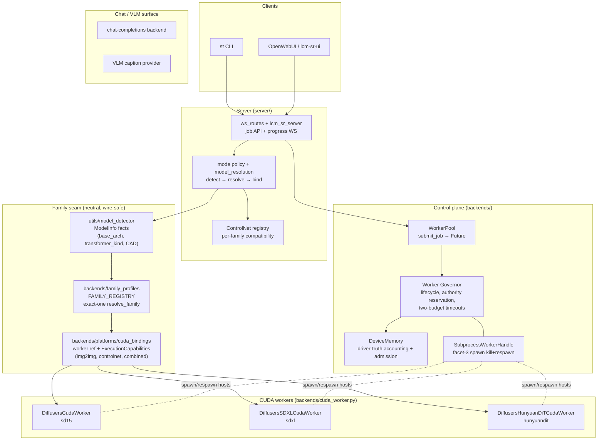
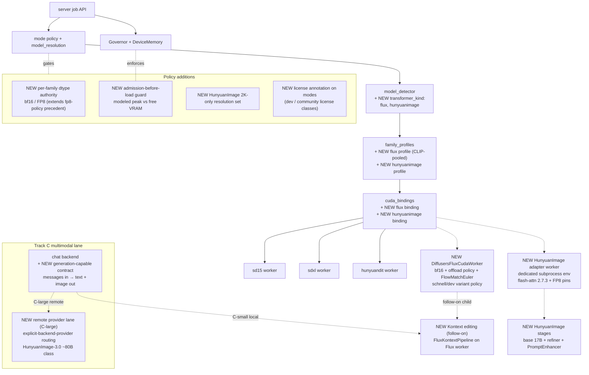

# Model Expansion Proposal: Flux, HunyuanImage, and Unified Multimodal Models

**Status:** Proposal — requirements outline (pre-spec; per-track specs are follow-ups)
**Date:** 2026-07-31
**Author:** Psi (agent)
**Related:** STABL-ichgkgno (HunyuanDiT family profile, merged PR #17), STABL-kfekehhc (from_pipe fp32 upcast OOM, done), STABL-nvmieaxh (VRAM umbrella), `docs/superpowers/specs/2026-07-16-hunyuandit-family-profile-design.md`, `docs/superpowers/specs/2026-04-13-explicit-backend-provider-design.md`, `docs/superpowers/specs/2026-04-07-chat-completions-backend-design.md`, `docs/superpowers/specs/2026-07-14-vlm-caption-provider-design.md`

## Purpose

Outline what Stability-Toys needs to support three expansion tracks:

- **Track A** — Flux text-to-image (FLUX.1 schnell / dev), diffusers-native.
- **Track B** — HunyuanImage 2.1 (Tencent, 17B DiT, 2K-native), custom-runtime.
- **Track C** — Unified multimodal models (LLM+diffusion+VLM: HunyuanImage-3.0 class, Kontext-class editors), split into local-feasible and remote-provider classes.

This is a decomposition and requirements document. Each track gets its own spec → plan → implementation cycle later. Nothing here is implementation-approved yet.

## Scope Note

These are three independent subsystems of very different sizes. They share the family-profile substrate but should not be specced as one project. Recommended sequencing is in §8.

---

## 1. Current Architecture

The HunyuanDiT family profile (PR #17) established the six-seam integration pattern every new family plugs into: detector facts → neutral family registry → platform binding → worker delegate → mode policy → ops substrate.

**Seams, briefly:**

1. **Detector facts** — `utils/model_detector.py` emits `ModelInfo` (`base_arch`, `transformer_kind`, `cross_attention_dim`, config facts). Family predicates key on transformer-kind/config facts, never UNet CAD (the masquerade trap).
2. **Neutral profile** — `backends/family_profiles.py`: pure wire-safe `FamilyProfile(family_id, encoder_roles, pooled_required, pooled_projection_role, control_image_kwarg)`; exact-one `resolve_family`; profiles cross the subprocess boundary as data.
3. **Platform binding** — `backends/platforms/cuda_bindings.py`: family → lazy dotted worker ref + `ExecutionCapabilities(supports_img2img, supports_controlnet, combined)`.
4. **Worker delegate** — per-family worker class in `backends/cuda_worker.py` with per-family kwargs filtering.
5. **Mode policy** — modes bind `model_path` → detected family; resolution sets gate allowed sizes; ControlNet registry resolves per-family compatibility.
6. **Ops substrate** — DeviceMemory driver-truth accounting, demand-reload, Governor lifecycle, facet-3 subprocess isolation, two-budget execution timeouts, live acceptance on enigma (24 GB RTX 3090 floor) with recorded `peak_allocated_bytes`.

---

## 2. Target Architecture with Additions

Dashed edges and `NEW` nodes are additions. Solid gray-area nodes are existing seams that gain new entries but no structural change.

---

## 3. Cross-Cutting Requirements (all tracks)

| ID | Requirement |
|---|---|
| R1 | **Per-family dtype authority.** The repo is fp16-centric; the new families are bf16/FP8-native. Extend the SDXL fp8-runtime-policy precedent into a per-family dtype policy recorded in mode metadata (Flux: bf16, optional fp32 text-encoder override; HunyuanImage: FP8). |
| R2 | **Admission before load.** Refuse mode+resolution combinations whose modeled peak exceeds free VRAM instead of OOMing. Generalizes kfekehhc candidate #3 into reusable machinery; DeviceMemory owns the verdict. |
| R3 | **License annotation.** FLUX.1-dev (non-commercial) and HunyuanImage (tencent-hunyuan-community) are not Apache-class. Mode registration records license class; CLI/UI surfaces it. |
| R4 | **Spec/plan/drift per track.** Each track gets its own spec + implementation plan; family-profile spec and drift anchors updated per track (the 92b73ea reconciliation pattern). |

---

## 4. Track A — Flux txt2img (diffusers-native, smallest)

**Facts.** FLUX.1: 12B MMDiT transformer, CLIP-L (pooled) + T5-XXL encoders, 16-ch AutoencoderKL, FlowMatchEulerDiscreteScheduler, bf16-native. diffusers 0.39.0 (current repo pin) already ships `FluxPipeline`, `FluxImg2ImgPipeline`, `FluxControlPipeline`, `FluxKontextPipeline`. Variants: **schnell** (timestep-distilled, 4 steps, guidance=0, max_seq 256, Apache-2.0) and **dev** (guidance-distilled, ~50 steps, embedded guidance ≈3.5, non-commercial license). ~50 GB of components at fp16 → **offload or quantization is mandatory on the 24 GB floor** (quanto-fp8 + CPU offload is documented below 16 GB).

| ID | Requirement |
|---|---|
| A1 | **Detector:** `transformer_kind="flux"` from transformer config facts; variant (schnell vs dev) from config (e.g. `guidance_embeds`) — validate exact keys at spec time. |
| A2 | **Profile `flux`:** `encoder_roles=("text_encoder","text_encoder_2")`, `pooled_required=True`, `pooled_projection_role="text_encoder"` (CLIP pools — inverted vs SDXL), `control_image_kwarg="control_image"`. Registry exact-one tests must show no overlap with sd15/sdxl/hunyuandit. |
| A3 | **Dtype:** bf16-first; optional fp32 text-encoder override (fp16 activation clipping shifts outputs — documented diffusers caveat). |
| A4 | **VRAM:** mode policy declares the offload strategy (`enable_model_cpu_offload` / group-offload / quanto-fp8 / bnb-8bit); DeviceMemory admission check before load. **Track A's headline decision — the spec must pick the default.** |
| A5 | **Worker `DiffusersFluxCudaWorker`:** Flux-native guidance semantics — embedded `guidance_scale`; `true_cfg_scale` + negative prompt only on dev; schnell rejects both. Per-variant defaults (4 vs 28–50 steps); `max_sequence_length` plumbing; 1024² default size. |
| A6 | **Scheduler:** FlowMatchEuler enters the scheduler-choices surface via a per-family allowlist; the DDPM/Karras surface does not apply. |
| A7 | **First delivery capabilities `(False, False, False)`** — txt2img only. Flux img2img, Canny/Depth control (**not** `ControlNetModel` — channel-concat alternate transformers or LoRA adapters), Fill, and Redux are separate FP children later. |
| A8 | **Conditioning:** native `encode_prompt` (prompt→CLIP, prompt_2→T5 routing). Compel compatibility unresolved → native-only first (open question). |
| A9 | **Acceptance:** schnell 4-step @1024² on enigma under the chosen offload strategy, `peak_allocated_bytes` recorded; dev as stretch. |

---

## 5. Track B — HunyuanImage 2.1 (custom-runtime track)

**Facts.** 17B single+dual-stream DiT; 32×-compression VAE (REPA-aligned); dual encoders = **MLLM (vision-language)** + ByT5 glyph-aware; optional refiner stage; optional PromptEnhancer rewriting model; distilled variant (8 steps, cfg 3.25, shift 4) and full variant (50 steps, cfg 3.5, shift 5). **2K-only** — supported pairs (2048², 2560×1536, 2304×1792, and inverses); 1K yields artifacts. **Not in diffusers**: Tencent's `hyimage` package with `flash-attn==2.7.3` pin; FP8 quantized release → 24 GB with offload+FP8; Linux+CUDA only; tencent-hunyuan-community license.

| ID | Requirement |
|---|---|
| B1 | **Integration fork (the big decision):** (i) adapter worker wrapping `HunyuanImagePipeline` inside a facet-3 subprocess with its own env pins — **recommended**, isolates flash-attn/torch conflicts from the main env; (ii) vendor into the main env and absorb the pin conflicts; (iii) wait for upstream diffusers support. |
| B2 | **Dependency-conflict audit first:** flash-attn 2.7.3 + FP8 kernels vs the repo torch 2.10.0+cu128 pins (STABL-zisphapv pin discipline); extends the test-cuda container path. This task can start in parallel with Track A. |
| B3 | **Resolution sets:** family-specific 2K-only allowed set; 1K requests rejected with a clear error at admission. |
| B4 | **Multi-stage shape:** `use_refiner` / `use_reprompt` mode flags; DeviceMemory must charge the refiner and enhancer models, not just the base DiT. Open question: can PromptEnhancer share the chat/LLM backend? |
| B5 | **Detector:** facts for the hyimage checkpoint layout (non-diffusers config); `transformer_kind="hunyuanimage"`. |
| B6 | **Profile + binding + worker per the six-seam pattern**, but the worker wraps the non-diffusers call signature (`width/height/use_reprompt/use_refiner/shift/seed`). ResolvedModel crosses the spawn boundary as JSON (existing facet-3 contract — no child re-resolution). |
| B7 | **VRAM:** FP8 + offload mandatory at 2K on the floor; peak runs near the ceiling — demand-reload and the R2 admission guard are hard requirements here, not options. |
| B8 | **Capabilities `(False, False, False)`;** no shipped ControlNet/img2img for 2.1. Community ControlNets out of scope. |
| B9 | **Multilingual:** acceptance includes a Chinese-prompt case (UTF-8 clean end-to-end). |

---

## 6. Track C — Unified Multimodal Models (LLM+diffusion+VLM)

**Facts.** Two size classes. **C-small** (7–14B, local-feasible): FLUX.1-Kontext (12B editing, *already in diffusers 0.39.0*), Qwen-Image-Edit, Janus-Pro, BAGEL-7B. **C-large** (60–80B): HunyuanImage-3.0 unified understanding+generation (reported ~80B class — confirm at spec time); even 4-bit quantized it exceeds the 24 GB floor. The interface is chat-shaped (interleaved image+text in → text and/or image out), not job-shaped.

| ID | Requirement |
|---|---|
| C1 | **Hard split by class.** C-small = local worker track. **C-large = remote-provider track** (fal / HF Inference Providers already serve HunyuanImage) riding the explicit-backend-provider design, honestly labeled non-local, with cost/timeout policy. Local C-large on enigma is a non-goal. |
| C2 | **Interface:** merges with the chat-completions + vision-chat + VLM-caption-provider specs, not the txt2img job path. Requirement: generation-capable chat backend contract — messages in, assistant message + image attachments out (upload-bucket routing already exists for image inputs). |
| C3 | **Kontext is the cheap first win:** fold it into Track A as a follow-on FP child (FluxKontextPipeline capability extension on the Flux worker) rather than standing up C infrastructure for it. Decision point — recommended. |
| C4 | **C-small local:** same detector/profile/binding/worker substrate + multimodal input plumbing (image attachments in requests). |
| C5 | **Safety policy:** Kontext ships a Pixtral integrity checker — decide run/skip/surface explicitly in the spec. |
| C6 | **Admission:** C-large local requests refused with a clear error at admission, never an OOM. |

---

## 7. Known Traps Carried Forward (from project-forward-notes)

- **Attention-processor swaps are not universally safe** — HunyuanDiT denoises without positional info under XFormers/sliced processors; expect per-family gating for Flux/HunyuanImage too.
- **Shared ControlNet kwargs are not universally accepted** — per-family kwargs filtering is already the pattern; Flux's control transformers and Kontext extend it.
- **Control-map fixtures are family-sensitive** — one shared fixture per family, reused by acceptance and probes.
- **`from_pipe` recasts by default** — always pass `torch_dtype=None` when composing pipelines (kfekehhc).
- **fp16 is not free** — bf16-native models upcast/downcast costs VRAM and quality; dtype is per-family authority (R1), never incidental.

## 8. Recommended Sequencing

1. **Track A** (Flux txt2img) — diffusers-native, follows the proven pattern, fastest to enigma acceptance.
2. **B2 dependency audit in parallel** — cheap, de-risks Track B early.
3. **Track B** (HunyuanImage 2.1) — new custom-runtime isolation track; bigger lift, higher quality ceiling.
4. **Kontext as Track-A follow-on** (C3) — first multimodal capability without new infrastructure.
5. **C-small / C-large** per appetite — requires the chat-lane contract (C2) and the remote-provider decision (C1).

## 9. Open Questions (load-bearing for the per-track specs)

1. Is the 24 GB enigma floor a hard constraint for all tracks, or is a larger host in play for C-large?
2. Are remote providers acceptable for C-large, or is the posture local-only?
3. License posture: are non-commercial checkpoints (FLUX.1-dev, Hunyuan community) first-class, or Apache-only (schnell)?
4. Does compel-style prompt weighting matter for Flux, or is native conditioning sufficient for first delivery?
5. Should PromptEnhancer (B4) share the chat/LLM backend rather than load its own model?

## 10. Non-Goals

- img2img, inpainting (Fill), Redux, IP-Adapter, and Flux control transformers in first delivery (deferred FP children).
- Community ControlNets for HunyuanImage 2.1.
- Local execution of 60B+ unified multimodal models on the 24 GB floor.
- Any change to the sd15/sdxl/hunyuandit family contracts beyond additive registry entries.
